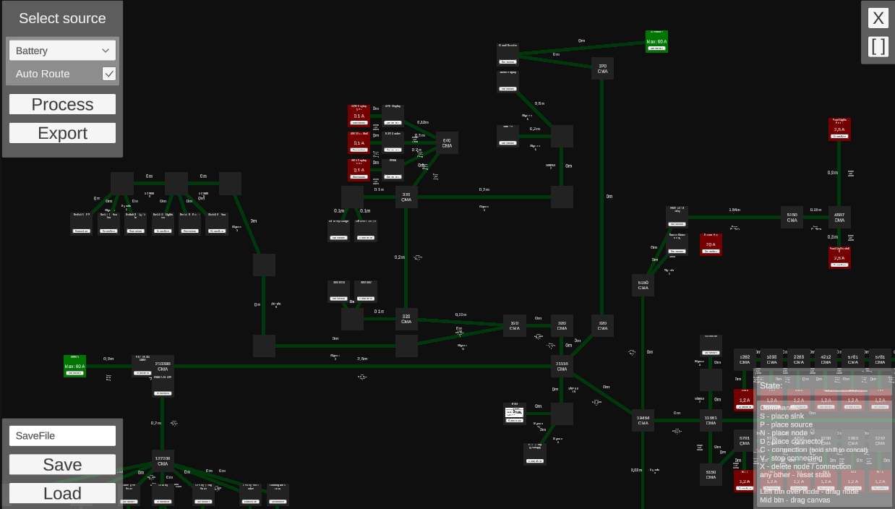
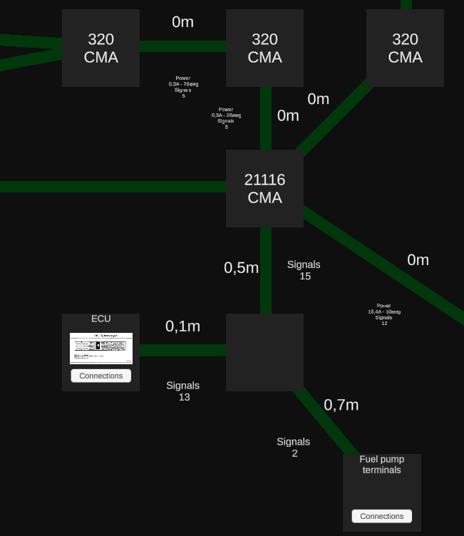

# HarnessPlanner

## Description

This is a small project to plan wiring harnesses.
It features auto calculation of wiring sizes and joints CMAs.

## Features

This list is not exhaustive, and features will be possibly added in the future.

- [x] Power and signal routing 
- [x] Auto calculation of wiring sections
- [x] Auto calculation of joints CMA
- [x] Export of wires sizes and length csv
- [x] Export of joints BOM csv
- [ ] Custom nodes with images
- [ ] Account for both battery and alternator currents at the same time
- [ ] Custom colors for wires
- [ ] Subnodes (or subsystems)

### Closeup view

This view provides a small insight of the displaying capabilities currently 
available.

It is possible to see, in fact, both the power carrying conductor sizes (awg) and splices CMAs are shown here,
together with some basic signal routing informations (the number of signal carrying conductors).

An insight into the future is provided by the ECU node, where a picture is provided, but for the time being it is not possible to create a custom node with its image from inside the program.

